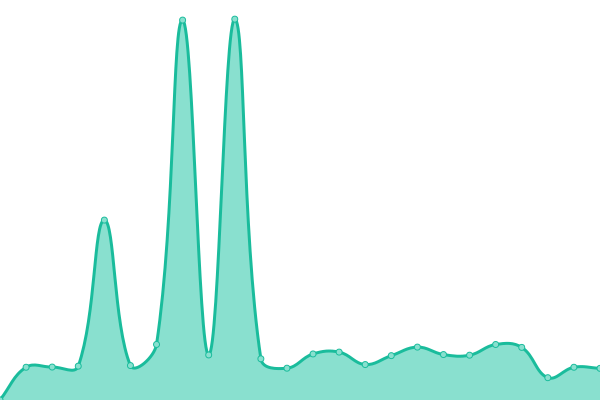

# [📈 Live Status](https://up.mpp.one): <!--live status--> **🟧 Partial outage**

This repository contains the open-source uptime monitor and status page for [Upptime](https://upptime.js.org), powered by [Upptime](https://github.com/upptime/upptime).

With [Upptime](https://upptime.js.org), you can get your own unlimited and free uptime monitor and status page, powered entirely by a GitHub repository. We use [Issues](https://github.com/upptime/upptime/issues) as incident reports, [Actions](https://github.com/MPPexcellent/upptime/actions) as uptime monitors, and [Pages](https://up.mpp.one) for the status page.

<!--start: status pages-->
<!-- This summary is generated by Upptime (https://github.com/upptime/upptime) -->
<!-- Do not edit this manually, your changes will be overwritten -->
<!-- prettier-ignore -->
| URL | Status | History | Response Time | Uptime |
| --- | ------ | ------- | ------------- | ------ |
|  [MPPone Personal Site](https://mpp.one) | 🟩 Up | [mp-pone-personal-site.yml](https://github.com/MPPexcellent/upptime/commits/HEAD/history/mp-pone-personal-site.yml) | 

 3965ms
     
 | 

<a href="https://up.mpp.one/history/mp-pone-personal-site">95.46%</a>
    

|  [BigNom](https://bignom.mpp.one) | 🟩 Up | [big-nom.yml](https://github.com/MPPexcellent/upptime/commits/HEAD/history/big-nom.yml) | 

 2673ms
     
 | 

<a href="https://up.mpp.one/history/big-nom">97.55%</a>
    

|  [Re3use](https://re3use.at) | 🟩 Up | [re3use.yml](https://github.com/MPPexcellent/upptime/commits/HEAD/history/re3use.yml) | 

 705ms
     
 | 

<a href="https://up.mpp.one/history/re3use">94.24%</a>
    

|  [Technologiehub AT](https://www.technologiehub.at) | 🟥 Down | [technologiehub-at.yml](https://github.com/MPPexcellent/upptime/commits/HEAD/history/technologiehub-at.yml) | 

 1360ms
     
 | 

<a href="https://up.mpp.one/history/technologiehub-at">87.14%</a>
    

|  [Technologiehub AT Wiki](https://wiki.technologiehub.at) | 🟥 Down | [technologiehub-at-wiki.yml](https://github.com/MPPexcellent/upptime/commits/HEAD/history/technologiehub-at-wiki.yml) | 

 3833ms
     
 | 

<a href="https://up.mpp.one/history/technologiehub-at-wiki">87.15%</a>
    

<!--end: status pages-->

[**Visit our status website →**](https://up.mpp.one)

## 📄 License

- Powered by: [Upptime](https://github.com/upptime/upptime)
- Code: [MIT](./LICENSE) © [Upptime](https://upptime.js.org)
- Data in the `./history` directory: [Open Database License](https://opendatacommons.org/licenses/odbl/1-0/)
